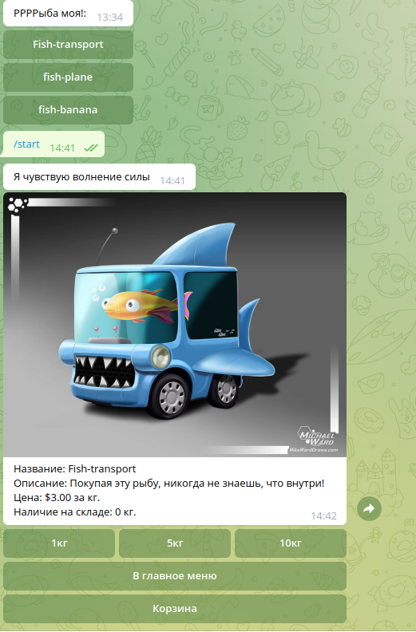

# Selling-fish-in-Telegram
[](https://www.python.org/)
[](https://telegram.org/)
[](https://www.elasticpath.com/)
## Description
This telegram bot is an interface of online shop(elasticpath in our case) for example, a funny fish store
## How to install
Python3 should be already installed.
You have allready registered in [elasticpath](https://www.elasticpath.com/)

- clone project from [github.com](https://github.com)
```shell
git clone git@github.com:toshiharu13/Selling-fish-in-Telegram.git
```
- Install and run [Redis](https://realpython.com/python-redis/)
- Use `pip` to install dependencies:
```bash
pip install -r requirements.txt
```
- Create and fill in .env file: 
```dotenv
TELEGRAM_TOKEN = 'Telegram bot token '
```
```dotenv
ELASTICPATH = 'Your elasticpath_user_id'
```
## Starting bot
Just type:
```shell
python tel_bot.py
```

Link to the Telegram bot: [@test_ork_bot](https://t.me/test_ork_bot)